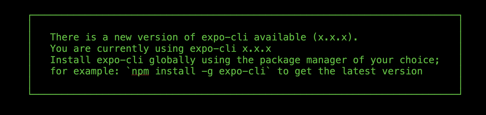
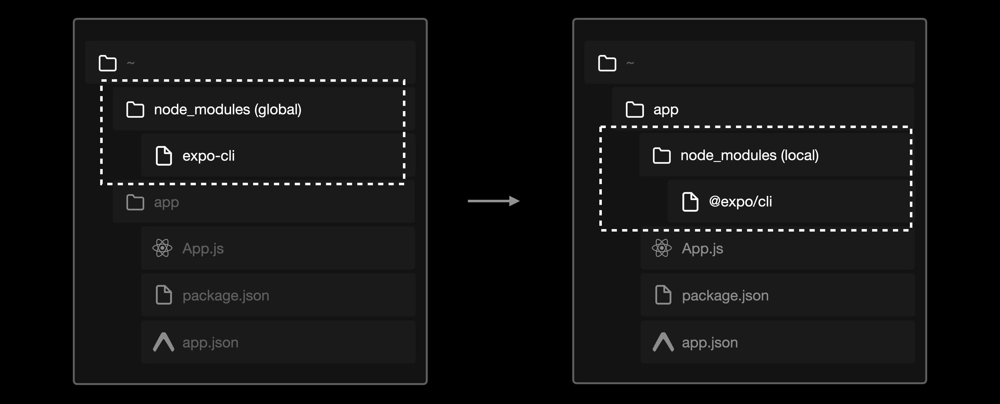
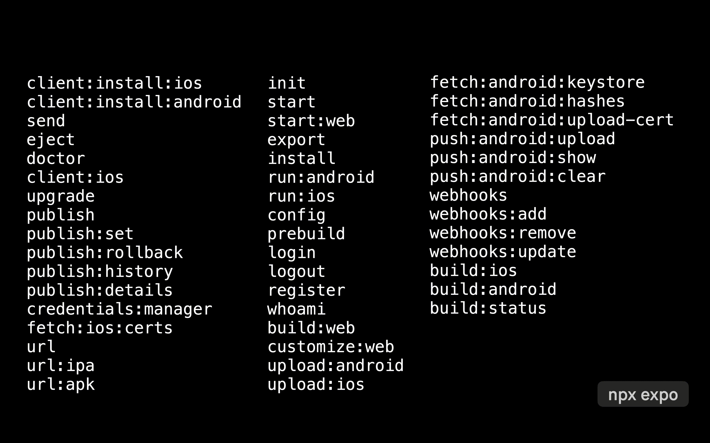

import { Embed } from '@/components/embeds';
import Thanks from '@/components/thanks';
import { Title } from '@/components/PostTitle';

<Title date="2022-08-09T09:10:56.839Z">The New Expo CLI</Title>

In Expo SDK 46 we introduced a new “Local Expo CLI”, to replace the “Global Expo CLI” (`npm i -g expo-cli`). Unlike the global CLI, the local CLI is installed in every project and stays versioned with the runtime code — meaning projects are easier to set up, stay working longer, and the tooling updates less often.

## Usage

The most important difference is that users must now invoke `npx expo start` instead of `expo start` to develop an app — users also no longer need to run `npm install -g expo-cli` as the CLI is shipped with the `expo` package.


You can continue to use `yarn start` or `npm run start` when the `package.json` contains:

```json
{
  "scripts": {
    "start": "expo start"
  }
}
```

This means you'll also no longer see the annoying and persistent “There is a new version of expo-cli” notice anymore:



This does mean if you need a CLI bug fix, you'll either need to update your `expo` package version or force the CLI version with Yarn resolutions in the `package.json`:

```json
{
  "resolutions": {
    "@expo/cli": "xxx"
  }
}
```

> 💡 The new package is technically called `@expo/cli` but we refer to it as the “Local Expo CLI”, “Versioned Expo CLI”, and in the future, we'll just refer to it as Expo CLI.

When you encounter a bug or issue with the CLI, report it on the [expo/expo repo](https://github.com/expo/expo/issues/new/choose) instead of the **expo/expo-cli** repo. The new CLI's [source code lives here](https://github.com/expo/expo/tree/main/packages/%40expo/cli).

## Lighter and faster

The global CLI needed to support all versions of Expo, and since there were 45 versions at the time, there was a lot of bloat and legacy functionality that could be removed. We had the satisfying honor of not only deleting all the dead code but also rewriting the remaining code to be substantially faster and more robust.


Instead of using `commander` (**166kB**) for the CLI interface, we opted to write everything from scratch with `arg` (**13.3kB**) — this wasn't the easiest approach, but it was worth it for bundle savings.

We also had to make some tricky choices and drop features that were unmaintained and underutilized (according to anonymous telemetry) like the [Dev Tools UI](https://blog.expo.dev/sunsetting-the-web-ui-for-expo-cli-ab12936d2206).

### Cloud-First

A smaller CLI also means you can install faster in CI (which was a central goal of this project). Installing locally means you need less complex caching in CI, simply cache the project's `node_modules` and you're golden!



### Stable

The **new** CLI has incredible tests, covering nearly aspect of the tooling! This means you can contribute with confidence that if the tests pass, you aren't potentially breaking something elsewhere.

## Expo's Cloud Services

The global `expo-cli` package included the ability to build/submit native app binaries and publish OTA updates with our [now deprecated](https://blog.expo.dev/turtle-goes-out-to-sea-d334db2a6b60) cloud services — all of which have been replaced by the new [Expo Application Services](https://docs.expo.dev/eas/) (EAS)!



Most of what lived in the legacy global CLI now lives in `eas-cli` which is agnostic to the Expo SDK version (available for use in any React Native app) and therefore doesn't need to be installed in a user's project.

The classic build service required native binaries like Fastlane for code signing which complicated the overall package. Now that we've moved these features, Expo apps are much easier to use in more places. For example, modern tools like CodeSandbox, Replit, and Blitz can _potentially_ be used for building universal apps in the browser as an alternative to [Snack](https://snack.expo.dev/).

Most of the updates users were getting to the legacy Expo CLI were related to the cloud services, essentially had no overlap with the tools used for local development. So, no need to worry about seeing fewer updates to the Local Expo CLI, we're still actively building new features and fixing bugs — these will be released at the same cadence as other Expo SDK packages.

## Ejecting

**TL;DR:** `expo eject` → `npx expo prebuild`

When `expo eject` was first introduced, the word “eject” was a fairly accurate description of what it would do: it would suddenly throw out you from the comforts of the Expo ecosystem. You were not provided with a metaphorical parachute, so the landing upon ejecting was usually pretty rough — sometimes the project required additional configuration to build, and you couldn't lean on Expo's update or build service anymore. Some modules didn't work. But, this used to be necessary when developers wanted to add native modules that weren't in the Expo SDK ([more information in “Expo managed workflow in 2021”](https://blog.expo.dev/expo-managed-workflow-in-2021-5b887bbf7dbb)). None of this is true anymore, and so we have removed the “eject” command from the local CLI.

In early 2021 ([Expo SDK 41](https://blog.expo.dev/expo-sdk-41-12cc5232f2ef)), we introduced support for custom native code in managed workflow projects with EAS Build and a CLI command called `expo prebuild` — which works like a bundler for generating native projects, where the output folders are `ios` and `android`.

Prebuild supports generating native configuration from every field in the Expo config file (`app.json` & `app.config.js`) and is designed for library authors to extend the process using a system called “Expo Config Plugins”. With this in place we could safely move away from the concept of “ejecting” in favor of “prebuilding” which every project has to go through before native building.

We're pleased to announce that in the new Local Expo CLI, `expo eject` is no longer available, it's been fully replaced by `npx expo prebuild`!

## Bundling Improvements

We have plans to improve the Metro bundler and provide a more modern developer experience with features like **React Suspense**, context modules, and **Metro for web**. The new local CLI sets us up perfectly to start supporting these features. We've already begun shipping new Metro features starting with [experimental web support](https://docs.expo.dev/guides/customizing-metro/#web-support), and have PRs open for [context modules](https://github.com/facebook/metro/pull/822).


## Quality of Life

Since we were planning a rewrite, figured it would be a good time to simplify everything and add some quality of life features. Here are a few of our favorites:

1. `npx expo` is now an alias for `npx expo start`.
2. Sending massive `console.log`s is [now supported](https://twitter.com/Baconbrix/status/1554859644375400450/video/1).
3. `npx expo install` now has a `--fix` flag which installs the correct versions of installed packages. You can also provide specific packages to fix like `npx expo install expo-sms --fix`. We've also added a `--check` flag which can be used in CI to fail if packages are outdated.
4. `npx expo run:android` now has a `--no-build-cache` argument to match `npx expo run:ios`.
5. `npx expo customize` allows you to pass in filenames to generate without prompting: `npx expo customize babel.config.js`.
6. Reduced global side-effects of `npx expo start` to a single ngrok value in the `.expo` folder, meaning runs are more idempotent — before this change, URL arguments like `--port` could leak into different Expo CLI processes.
7. A warning will be printed to suggest restarting the dev server when you modify `metro.config.js`, `babel.config.js`, and `webpack.config.js` while the dev server is running.

## Notice

We know large changes like this are complicated, and we appreciate the patience of everyone involved! We're confident that the new CLI will bring many positive changes and make the developer experience much more stable going forward! Right off the bat, we have a PR open to add [custom entry point support](https://github.com/expo/expo/pull/18381) for projects using the local CLI.

<Thanks />
