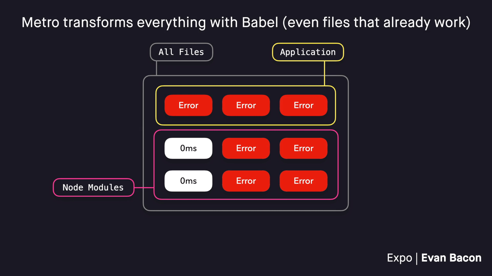

import { Embed } from '@/components/embeds';
import Thanks from '@/components/thanks';
import { Title } from '@/components/PostTitle';

<Title date="2021-10-08T22:45:36.616Z">
  Drastically Faster Bundling in React Native
</Title>

## Expo “Exotic” System

Modern web development is fast, scalable, and iterative. With new tools like ESBuild, SWC, and Sucrase emerging, we at Expo figured it was time to start looking at how we can utilize new bundler techniques to improve cross-platform app development.

Today I'm proud to introduce the largest bundling improvement, possibly in the history of React Native. This is the next large step in closing the gap between the native and web ecosystems.

To use it, update to `expo-cli@^4.12.0` or greater, and enable the beta flag `EXPO_USE_EXOTIC`:

```sh
EXPO_USE_EXOTIC=1 expo start
```

This will enable a set of experimental bundler improvements for Metro (the default bundler for React Native), the most notable of which is a faster JavaScript transformer.

The results are as follows (measured against a hello world app):

- **~2x Faster** for initial bundling.
- **~18% Smaller** production bundles.

- [**Documentation**](https://github.com/expo/expo-cli/tree/master/packages/metro-config) for the feature.


_`expo start -c` in a blank project (iOS) with Exotic enabled: ~100% faster._

## Improvements Explained

To understand how these improvements work, you'll first need to understand how bundling works.

When you create a Node project, whether it uses React DOM, React Native, or another library/framework, you'll have a bunch of files using various JavaScript language features. Each file adds to the total time that it takes to transform the application source code before we send it to the runtime (Web browser, Expo Dev Client, etc).


_Consider every file and how long they take to Transpile_

The files in our app can be divided into two logical groups; application code, and Node modules. This distinction is important for a bundler. Application code is unpredictable, the user can change the rules at any time. One day, you might use `require` in your code, and the next, you could be using `import`/`export`.

In contrast, Node modules are more static. High-quality Node modules will often be shipped with support for different JavaScript module systems, the main two being ES Modules (`module` field in the package.json), and CommonJS (`main` field in the package.json). We can use these standards to help us optimize our bundling.


_These files can be split into two different groups_

The most obvious optimization would be to simply skip transforming our code. However, If we did this, many files would have runtime errors because they may be using language features that aren't supported in our runtime. For example, if you ship `import`/`export` syntax to a Node runtime, Node will error out because it doesn't know how to handle that feature.

> 💡 React Native is similar to a browser environment (JavaScriptCore engine), but it doesn't have a DOM API, so there's no way to pass ES Module code to the JS Engine. This means we need to use CommonJS code.


_Skipping all transformation would cause errors in many files_

To ensure our JavaScript code works, we can transform it using Babel. Babel is easy to customize, simple to use, and has a great ecosystem of plugins. However, the problem with Babel is that plugins add up and result in slower builds over time.

> 💡 React Native's Babel preset includes a long list of Babel plugins and does much of the same work as`@babel/preset-env`


_Babel can transform our code, but it's very expensive_

By default, Metro bundler will transform every file in your project using Babel. Using the most expensive transformation on the maximum amount of code is a simple approach that trades off speed for compatibility, but it turns out that we might not need to make this sacrifice for these two reasons:

1. Many Node modules, like `react` ship with CommonJS support, meaning the library author already transformed it, so you don't have to.
2. As your project progresses, you may find yourself adding Babel plugins for aliasing, adding dotenv support, etc. your untransformed Node modules almost certainly don't need these extra customizations, often they just need basic operations like `import`/`export` transformation, resulting in a lot of wasted time.



_Metro transforms everything with Babel (even files that don't need to be transformed)_

This is where my recent improvements come into place.

First, we group up the Node modules that are shipped untransformed, and skip transforming every remaining Node module, this is packages like `react` or `lodash` which go from some variable amount of time to transform, down to no time at all!

Already, this will result in some decent savings, but we can do more. In the React Native ecosystem, many packages are shipped untransformed (more on this later), meaning that the majority of our code is still being transformed with Babel.

As mentioned earlier, Babel has many customizations that you add for your project, and these customizations aren't needed for untransformed Node modules. If you take a look at this breakdown, you'll see that Babel is substantially slower than many newer options. There are plenty of reasons why these alternatives are faster, but the most important is that they trade off customizability for speed.

Switching all transformation over to one of these tools would be far from ideal because users would lose out on the ability to add custom language features to their projects. But there is one place we can safely use them…

](./images/1WTya9sLMBf2fIjJpXk_1iQ.png)

_Breakdown of JS transformers. [Cite: Sucrase repo](https://github.com/alangpierce/sucrase/blob/68ed7ff/README.md)_

In Expo CLI, we configure Metro to transpile our untransformed Node modules with Sucrase, resulting in substantially faster React Native bundling! We currently use Sucrase because:

1. According to the benchmarks, Sucrase is a very fast transformer, and we only need improved transformation. Notice: ESBuild is also a bundler and minifier, it's a bit of an apples to oranges comparison.
2. It has Flow support built-in, React Native ships with Flow types in place (I'd love to see this change!) so it's a no-op. I also experimented with using a fork of React Native that is transpiled ahead of time, but it was a bit inconvenient to maintain.
3. Finally, and possibly the most surprising: Sucrase is written in JS, whereas the others are native (Rust, Go, etc), this means that npm installs go smoother on Windows and Linux machines and reduces npm install log-spam from optional dependencies. This is a real concern for many new developers and it's also a tax on maintainers to handle issues related to the install logs.


_We use a faster system for transforming static libraries; Surcase instead of Babel._

Metro bundler has no concept of “loader rules”, this is a feature from the popular bundler **Webpack,** that I've shoehorned into Metro with a custom transformer.

To summarize: “Exotic” is a Metro transformer with three default “loader rules”:

1. Application code uses **Babel** for max customization.
2. We compensate for untransformed Node modules by using **Sucrase **(or a related tool).
3. And finally, we pass everything else through to the runtime, without needing to transform it.


_Exotic is a metro transformer with loader rules that handle groups of files differently._

And just like that, we now have a system which is a lot more like web development, and in some regards a little bit better. In the web ecosystem, there are so few (major) packages that need to be transformed locally that the concept of having first-class support for optimizing this step isn't really worth the effort or added complexity.

The React Native ecosystem is almost **exclusively** made up of packages which need to be transformed locally, providing us with ample reason to improve it with a Sucrase loader rule.

Again, the results are about 2x faster in basic “Hello World” projects and stay fast at scale, making your large production apps bundle noticeably faster than before:


_At Scale: Expo “Native Component List” Monorepo bundles ~14s faster (gif 2x playback)_

As a bonus, bundle sizes are also smaller by about 18% in “Hello World” apps. This is because many libraries are already shipped in an optimal format, and by needlessly transforming them with a random Babel cocktail, we increase the size, but only a little bit, and everywhere.

With Expo's Exotic transformer we don't have this issue, we do less, and get more (technically we get less JS, but you get it)!


_Running `expo export` in a fresh project with Exotic enabled: ~18% size reduction._

## Important Considerations

This approach isn't without its flaws. To quickly deduce which Node modules are untransformed, we need to keep a hard-coded list of the packages that don't work — it's not 100% comprehensive, packages that don't start with `react-native-*` or `expo-*`, etc, may need to be added manually.

Meaning you, as the user, have to know a little bit about what's going on behind the scenes — which is why I spent hours making animated gifs (harder than actually building the system).

This constraint is the same in the web ecosystem, where the user is responsible for manually defining every package that needs to be transpiled locally, e.g. in Next.js, this is done via `next-transpile-modules`. This is easier for web dev because most popular web packages take the time to ship modules as transformed code.

**React Native is a little different.** Because Metro bundler has been using this naive “transform everything” approach for so long, almost every community package (including `react-native` itself!) have been shipped as untransformed code.

In fact, Metro has first-class support for this anti-pattern. You could use a `react-native` field in your Node module's `package.json` to define where your source is (often this is TypeScript or Flow), and Metro will use that as the entry point instead of the main/module fields.

In Expo's Metro config, we compensated for these issues by making the following changes:

1. We opt-out of the `react-native` package.json field, and require packages to respect CommonJS/ESModules presets. Runtimes are not analogous to frameworks, `react-native` is not the JS engine, JavaScriptCore (Safari) or Hermes is, which means that if code is good enough for JSC on web, it's good enough for JSC on mobile (with the exception: JSC in React Native doesn't expose any mechanism for providing ESModule code so CommonJS must be used instead).
2. Expo's Metro config ships a hardcoded list of matchers for identifying packages like `react-native` which need to be transpiled locally, hopefully library authors read this article, update their packages, and we can reduce the hardcoded list to be nothing at all. In the future, just like web dev, each project should be responsible for maintaining a list of packages that require local transpilation.

## I Need Your Help

This project is aimed at shifting the React Native ecosystem to ship better libraries and making Metro bundler work more like a web bundler. By closing this gap, and making React Native more bundler agnostic (like React.js) we can easily move between different bundlers like Webpack or ESBuild. No longer should we have to feel FOMO when React.js frameworks get lightning-fast bundler improvements, or useful new bundler plugins, etc. As React developers, we should be able to utilize these things too, but it'll take some major changes to catch up and make this a reality.

## Finally

If you enjoyed this article and found it helpful, please share it with other React developers!

Special thanks to [Lydia Hallie](https://medium.com/@lydiahallie), and [Brent Vatne](https://twitter.com/notbrent) for proofreading, [Satyajit Sahoo](https://twitter.com/satya164) for sanity checks on Metro bundler's `react-native` package.json feature, and as always the Expo team for sponsoring my research and open source.
