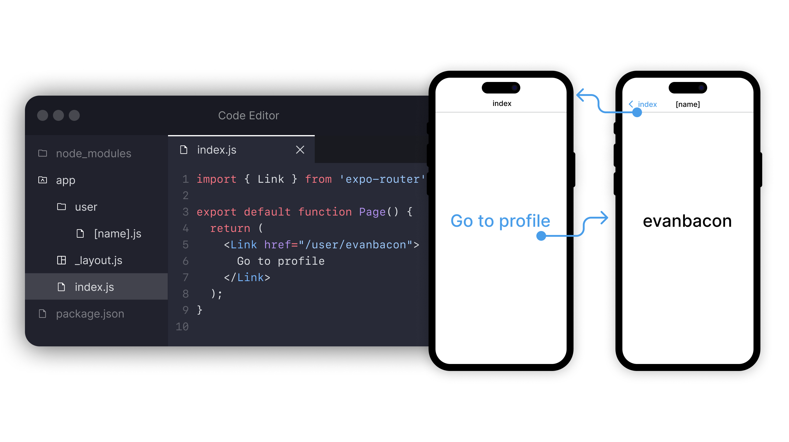

import { Embed } from '@/components/embeds';
import Thanks from '@/components/thanks';
import { Title } from '@/components/PostTitle';

<Title date="2023-02-02T00:31:23.913Z">Announcing Expo Router v1</Title>



> The First File-Based Router for Native Apps!

As part of Expo SDK 48, we’re releasing the first stable version of Expo Router! Any breaking changes or major features will now be implemented in Expo Router v2 which we’ll begin working on today ([read the roadmap](https://github.com/expo/router/discussions/309)).

Learn more about what’s possible in Expo Router in the [v1 RC announcement](https://blog.expo.dev/announcing-the-expo-router-v1-release-candidate-c5680b88a18c) and in the [Expo Router documentation](https://expo.github.io/router).

## Get started today with one line

```terminal
npx create-expo-app@latest -e with-router
```

- See the [advanced setup](https://expo.github.io/router/docs/) for more info. You can also learn about upgrading a [React Navigation project to Expo Router](https://expo.github.io/router/docs/migration/react-navigation/link).
- Hand’s on learner? Here’s a [sample To Do List app](https://github.com/expo/router/tree/main/apps/demo).
- Does it work with React Native community CLI? Can you use Expo Router without Expo? These and other questions can be answered in [the Expo Router FAQ](https://expo.github.io/router/docs/faq).
