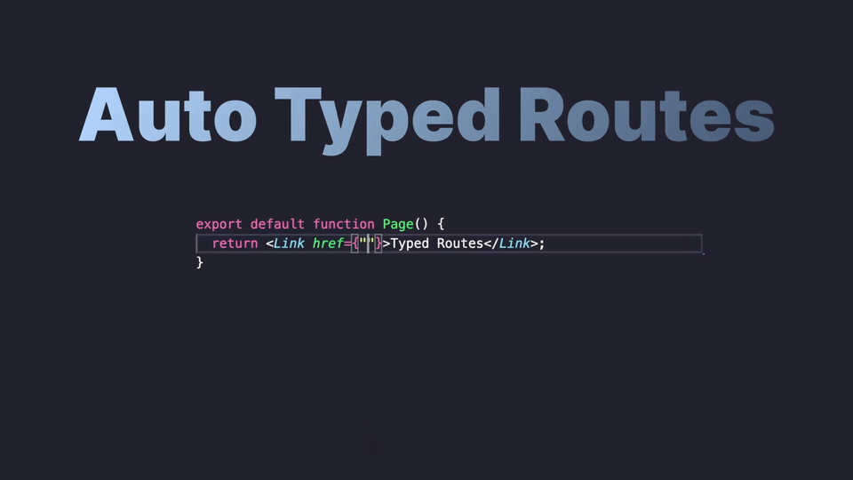
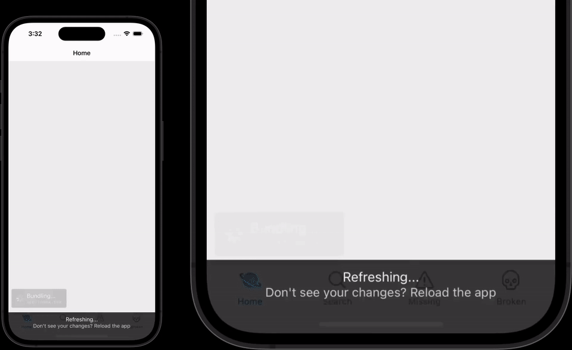

import { Title } from '@/components/PostTitle';

<Title date="2023-07-05T00:31:23.913Z">Announcing Expo Router v2</Title>

Expo Router v1 has had an exciting first 5 months! From winning a React Open Source Award, to powering the Kick streaming app — which grew to be #5 in the iOS App Store for Photos & Videos.


Today we’re launching Expo Router v2––this is a monumental step forward for building a truly-native app and a performant website simultaneously.

## Get started today with one line:

```
npx create-expo-app@latest --template tabs@49
```

- See the [advanced setup](https://docs.expo.dev/routing/installation/) for more info.
- Hands-on learner? Here's a [sample To Do List app](https://github.com/expo/router/tree/main/apps/demo).
- Does it work with React Native community CLI? Can you use Expo Router without Expo? These and other questions can be answered in [the Expo Router FAQ](https://docs.expo.dev/router/reference/faq/).

## Automatic TypeScript

Expo Router v1 automated away both the runtime boilerplate and the linking configuration from React Navigation, but developers still had to manually define the TypeScript definitions.

Now Expo CLI can continuously generate static type definitions for every route in your Expo Router app, automatically. Learn more: [Typed Routes](https://docs.expo.dev/router/reference/typed-routes/).



Importing components and styles outside of the **app** directory can lead to lots of spaghetti imports, which don’t just look bad, but also make refactoring routes much more difficult. To solve for this, we’ve built first-class support for [`tsconfig.json` paths and baseUrl](https://docs.expo.dev/guides/typescript/#path-aliases) into Expo CLI. If you were previously using `babel-plugin-module-resolver` to enable this feature in the transformer, you can now remove it from your `babel.config.js`.


Finally, we’ve added a generated typed environment file which mutates React Native types to support React Native Web properties as well — meaning a lot less `ts-expect-error` annotations littered around the styles.

## Static Routes

Expo Router v2 is the first version of Expo web to have first-class support for [build-time static generation](https://docs.expo.dev/router/reference/static-rendering/) (useful for SEO) and the Node.js environment — counting iOS and Android, we’re up to four platforms now!

All routes can now be rendered to static HTML, which can be hosted from most standard web servers. When using the Expo Router Link component, we’ll continue to use client-side navigation for faster in-app transitions.

To improve search engine optimization (SEO) even further, we’ve added a new `expo-router/head` component which can be used to define static or dynamic head metadata like the page title, description, and open-graph data.


Additionally, we’ve also introduced the new `app/+html.js` file which can be used to configure the default HTML wrapper for each route. This is useful for adding global tags like google analytics or other values which fall outside the traditional scope of React.

```json app.json
{
  "expo": {
    "web": {
      "bundler": "metro",
      "output": "static"
    }
  }
}
```

---

Not all libraries in the React Native ecosystem support static rendering — mainly because there’s never been a first-class React Native tool for testing with until now. We’ve already updated most of the Expo SDK to support running in Node.js environments; please report any hydration issues or invalid browser API usage to the appropriate repositories.

## CSS and Styling

The introduction of static rendering means hydration issues are now a possibility. Hydration issues tend to happen when you use JS to dynamically configure styles. Instead, you should use CSS and media queries for dynamic properties on web. We’ve added an opinionated set of modern CSS features to Expo CLI to ensure you have the tools necessary to build great websites:

- [Global CSS and CSS inside of node modules](https://docs.expo.dev/versions/v49.0.0/config/metro/#global-css)
- [Sass and SCSS](https://docs.expo.dev/versions/v49.0.0/config/metro/#sass)
- [CSS Modules, and sass variants](https://docs.expo.dev/versions/v49.0.0/config/metro/#css-modules)
- [PostCSS configuration files and plugins](https://docs.expo.dev/versions/v49.0.0/config/metro/#postcss)
- [Tailwind CSS](https://docs.expo.dev/versions/v49.0.0/config/metro/#tailwind)

On native, all of these features will be shimmed out to prevent errors.

```js metro.config.js
const { getDefaultConfig } = require('expo/metro-config');

/** @type {import('expo/metro-config').MetroConfig} */
const config = getDefaultConfig(__dirname, {
  // Enable CSS support.
  isCSSEnabled: true,
});
module.exports = config;
```

You can create CSS Modules, for example, by using the `module.css` extension:

```css styles/home.module.css
.container {
  display: flex;
}

@media screen and (max-width: 640px) {
  .container {
    display: none;
  }
}
```

This can be used by importing in files, just like any modern React framework:

```tsx
import styles from '@/styles/home.module.css';
import { Platform } from 'react-native';

export default function Page() {
  if (Platform.OS === 'web') {
    return <div className={styles.container}></div>;
  }
  // Native-only ...
}
```

This first iteration of CSS should be thought of as a first-class escape hatch for dropping down to the “native” web platform as needed. We plan to continue improving the universal primitives and building APIs that you write once and run everywhere.

## Async Routes

**Expo Router is designed for scale**. We’ve [teamed up](https://github.com/motiz88/discussions-and-proposals/blob/lazy-bundling/proposals/0000-lazy-bundling.md#adoption-strategy--how-we-teach-this) with the React Developer Experience team at Meta to add [first-class lazy bundling](https://docs.expo.dev/router/reference/async-routes/) to Expo Router (experimentally in Expo Router v2).



You can now incrementally bundle your app one page at a time, rather than all at once. This is great for working across large teams, or massive apps with thousands of screens.

Additionally, async routes further improve the [already incredible upgrading story](https://docs.expo.dev/workflow/prebuild/#sensible-upgrades) in Expo by deferring errors until you load a page. This means if one page out of a thousand has an error, it won’t take down the entire app. This enables you to progressively upgrade your app over time.

Async Routes is experimentally available in Expo Router v2, only enabled in development, and currently doesn’t support static rendering (due to constraints around React Suspense).

## Universal Linking

Expo Router uniquely enables fully discoverable apps, by combining statically rendered web content with truly native mobile views. It does this by creating universal links to every route in the application automatically. And in Expo Router v2 we’ve continued to automate away the one-time setup process for associating an app with a website.


We’ve also added iOS support to Expo Head. This configures deep-native functionality that is often only found in stock-Apple apps. For example, seamless handoff between web and native, automatic support for creating Apple notes on any page, and contextualizing Siri commands for improved accessibility and hands-free interaction. Learn more in the [Universal Linking guide](https://docs.expo.dev/guides/deep-linking/).

## Additional features

- You can now use a **src/app** directory to collect all of your source code in one place.
- The new `router` export can be used as an imperative API to navigate from global stores and providers.
- The `web.favicon` field in `app.json` can now be used to generate favicon images automatically at build-time.
- The root `index.js` file is no longer required. Simply point the main field in `package.json` to `expo-router/entry` and reload the app.
- The default **ErrorBoundary** component is now symbolicated to show more useful error snippets.
- Query parameters are now automatically encoded.
- Expo Router supports Reanimated Shared Element Transitions.
- Expo Router now supports `expo-dev-client`.
- The default empty layout will now use a safe area view.
- You no longer need to define a default scheme in the app.json to use Expo Router.
- Added the new `router.canGoBack()` function for detecting if there’s valid history for using `router.back()`.
- Exposed `getId` for Screens to enable custom pushing behavior.
- CSS has been moved upstream to Expo and now uses static extraction to support running on web without JavaScript enabled.
- The Expo Router docs are actively being re-written and added to the Expo docs. General integration (usage with notifications, authentication, etc.) to follow.
- Expo **Webpack has been moved to maintenance mode**, Expo Router is now the preferred way to build websites with Expo.
- Internal types are much stricter, drastically increased test coverage, more navigation structures are continuously tested against.

## Migration

Expo Router v2 is designed to be used with Expo SDK 49.

1. Ensure you [upgrade to SDK 49](https://blog.expo.dev/expo-sdk-49-c6d398cdf740).
2. Run `npx expo install --fix` to update Expo Router to the correct version.
3. If you have a dev client, you’ll need to re-build to update the native code.
4. Update `useSearchParams` to `useGlobalSearchParams` or `useLocalSearchParams` depending on your needs.
5. Update web document titles using `<Head />` instead of React Navigation Stack titles.
6. Migrate `navigation.canGoBack` to the new `router.canGoBack` function.

All additional features can be **incrementally adopted** by following their respective guides:

- [Async Routes](https://docs.expo.dev/router/reference/async-routes/)
- [Typed Routes](https://docs.expo.dev/router/reference/typed-routes/)
- [Static Rendering](https://docs.expo.dev/router/reference/static-rendering/)
- [CSS for web](https://docs.expo.dev/versions/v49.0.0/config/metro/#css)
- [Universal Linking](https://docs.expo.dev/guides/deep-linking/)
