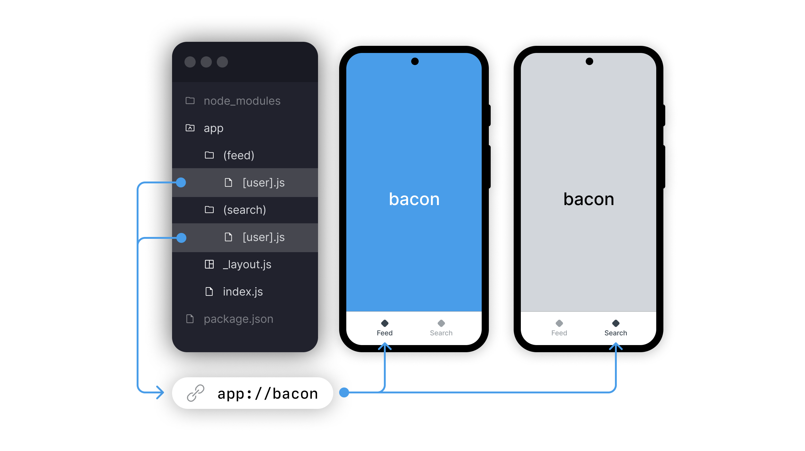

import { Embed } from '@/components/embeds';
import Thanks from '@/components/thanks.mdx';
import { Title } from '@/components/PostTitle';

<Title date="2021-05-28T00:16:51.286Z">Expo Router v1 Release Candidate</Title>

> The First File-Based Router for Native Apps!

The future of native navigation is here, and it's file-based! With the new Expo Router v1 (Release Candidate), pages are automatically generated by simply creating files in your project. You can focus on building the content of your pages rather than wrestling with all the boilerplate required to compose pages together. Try it out for yourself and see just how fast and easy, truly native development can be!

**Get started today with one line:**

```terminal
npx create-expo-app -e with-router
```

See the [advanced setup](https://expo.github.io/router/docs/) for more.

## Conventions

Expo Router defines routes using file names and directories inside the root `app/` directory:

- **Basic Routes** — automatically add pages to your app. The route matches the name of the file, e.g. `home.js` becomes `/home`


- **Layout Routes** — `_layout.js` file in any directory, will wrap all the children in the given directory. This can be used to create shared UI elements like headers and tab bars. Expo Router includes three default navigator components from React Navigation: Stack, Tabs, Navigator. Learn more in [Expo Router: Native Layouts](https://expo.github.io/router/docs/features/routing#native-layouts).


- **Dynamic Routes** — `[slug].js` enables variable matching of a segment. Useful for posts, content, user profiles, etc. Adding the `...` rest operator will match multiple segment levels.


- **Group Routes** — `(group)/` wrapping a directory in parentheses will skip adding a segment to the URL. Learn more in [Expo Router: Groups](https://expo.github.io/router/docs/features/routing#groups).
- **Shared Routes** — present different components simultaneously while leveraging the same URL for both. Useful for user profiles, or other content which can be accessed from multiple tabs in-app.



Learn more in [Expo Router: Routing](https://expo.github.io/router/docs/features/routing).

## Linking

With Expo Router you move between pages using URLs and a `<Link />` component. Dynamic routes automatically push screens according to the slug.


Learn more in [Expo Router: Linking](https://expo.github.io/router/docs/features/linking).

## Metro for Web

To make Expo Router fully universal, we added web support to the Metro Bundler. This enables developers to use a single dev server, port, URL, and config for iOS, Android, and the web! Error messages, warnings, and the developer experience are now substantially more unified across platforms. Metro for web includes the following features:

- Fast Refresh — it's really fast!
- Automatic React Native web aliasing.
- Expo SDK support — `expo-constants` manifest.
- Unified LogBox Errors and stack trace symbolication.
- SPA-styled exporting with `npx expo export` — pending more advanced rendering patterns.


Building Metro for web is part of our larger commitment, at Expo, to improve the Metro bundler across all platforms. Special thanks to the Metro team at Meta for their extensive support in this.

Learn more in [Metro for web](https://docs.expo.dev/guides/customizing-metro/#web-support).

## 404s & Sitemap

Expo Router automatically handles missing routes to ensure a resilient user experience by default, this can be customized using dynamic routes.


## Splash Screen

Expo Router automatically controls splash screen visibility while the navigation UI is rendering, preventing the “white flash” from ever showing, [learn more](https://expo.github.io/router/docs/features/splash).


## Navigation Reimagined

Even though Expo Router leverages our powerful React Navigation suite, we've unified how many core routing concepts work across web and native. For example, instead of rehydrating complex state objects on native, you can redirect to a URL to achieve the same result.

Learn more in the [React Navigation migration guide](https://expo.github.io/router/docs/migration/react-navigation/link).

## Release Candidacy

This is a mostly-stable release of Expo Router which we will promote to v1 after it's been user tested for bugs. New major features will not be added until v2 work begins.

Expo Router v1 proves that file-based routing for native apps is not only possible, but also an incredibly powerful, scaleable, and enjoyable system! We will be releasing the stable v1 with Expo SDK 48, or earlier!

Report any bugs on the [**expo/router** repo](https://github.com/expo/router/issues). See the [demo todo list](https://github.com/expo/router/tree/main/apps/demo) app for ideas of what's possible!

## Known Issues

Below is a list of currently known issues or feature requests we haven't resolved as of v1:

- **Limited documentation**: The API is still actively being worked on so we haven't documented the router with the level of finesse that one might expect from Expo docs. Testing, types, and exhaustive examples are not documented.
- **Automatic TypeScript types**: We will be adding a number of automated types to Expo Router, however, this is not a priority for v1.
- The convention is not ready for advanced use cases such as matching characters that cannot be expressed in a file name.
- **Server-based patterns**: patterns like server-protected routes (authentication) are partially emulated in runtime space, but they aren't as expressive as we'd like them to be.
- There currently exists no system for statically defining incoming URL rewrites.

---

¹ Web frameworks using file-based routing include SvelteKit, Next.js, and Remix.
