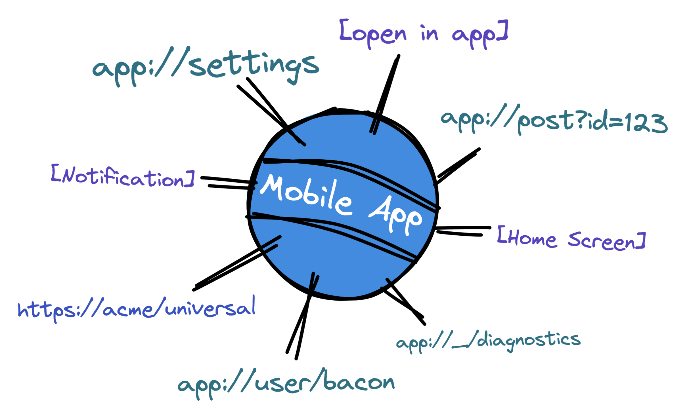

<Title date="2022-09-27T00:31:23.913Z">
  RFC: File-Based Routing in React Native
</Title>

> **TL;DR:** The new library Expo Router is a work in progress, join the [discussion on GitHub](https://github.com/expo/router/discussions/1)! Refer to the [**Expo Router documentation**](https://expo.github.io/router) to get started and learn more.

### Motivation

One of the hardest, unsolved problems in (cross-platform) app development is navigation. There's seemingly no right way to set up navigation in an app but there are a lot of wrong ways. Building native navigation is a manual, platform-specific, painstaking process that almost always falls short of its full potential (robust [universal links](https://developer.apple.com/ios/universal-links/), [app indexing](https://developer.apple.com/library/archive/documentation/General/Conceptual/AppSearch/index.html#//apple_ref/doc/uid/TP40016308-CH4-SW1), [handoff](https://developer.apple.com/handoff/), [app clips](https://developer.apple.com/documentation/app_clips/configuring_the_launch_experience_of_your_app_clip), etc.).

On the opposite end of the spectrum, you have web routing which is fast to build, easy(ish) to understand, discoverable, and extremely scalable. Outside of gesture-driven animations, web navigation is the gold standard. So why not bring it to mobile development?

### The problem

Getting a web-like system working for native apps is very difficult. Native has a lot of internal state that cannot be easily represented by a URL without assuming a lot of reasonable defaults at every step. Native apps need to run offline without a server. Native apps are also traditionally built with compiled languages making it hard to dynamically parse the file structure of the project in a way that's fast and responsive to the developer.

### The opinionated solution

This is where React Native comes in. The JavaScript/native interface, advanced bundling techniques, and a component-based architecture provide the baseline requirements for creating a workflow that is fast in development and _optimized_ for production.

Since [April 2021](https://twitter.com/Baconbrix/status/1384355891772739584?s=20&t=uRredgRat4ORWTmjd-Jf3g), I've been working on a new cross-platform router that generates nested navigation and deep links based entirely on the project's file structure. The concept of a file system-based router is not new to web developers (PHP, Next.js, etc.), but it is **brand new** to mobile development. By bringing this foundational paradigm to mobile, we move much closer to matching the discoverability, and scalability of websites in native apps.

## Goals

There are many applications for the new routing system. The most important goal is to make it fast and easy to create, maintain, and scale apps with nested native navigation. More features can be layered on top in later versions.

### Discoverable and scalable

Expo Router is a nested system that generates links for each _leaf route_ in the app. This lets users open and share any part of the app instantly with anyone. This feature is critical for content-driven applications like social media, news, and e-commerce, really anything content-driven.



Imagine you wanted to share a photo with a friend so you sent them a link to _instagram.com_ and told them to search around until they find the exact page you were thinking about. This is effectively how an app without deep links operates, and that leads to poor user adoption.

The web solved this problem decades ago by associating every page with a URL that can be instantly shared and visited by anyone. We plan to bring this same flexibility to mobile apps via Expo Router.

Because Expo is multi-platform, you can develop your routes once and share them across iOS, Android, and the web. This means you can utilize the built-in URL handling of the browser to quickly build out your native app's routes.


Ultimately we'd like to make all native apps support [**app search and content indexing**](https://developer.apple.com/library/archive/documentation/General/Conceptual/AppSearch/index.html) automatically. This will enable native search engines to index content in your app, making content discoverability radically better.

### Offline-First and Fast

Unlike web apps, native apps are all expected to work offline. This means that the app must be able to handle any incoming URL without a network connection or server.

_Navigation is truly native and optimized for iOS and Android_

We solved this by implementing new features across the entire framework ranging from [Expo SDK](https://docs.expo.dev/versions/latest/) to [Expo CLI](https://docs.expo.dev/workflow/expo-cli/) to the [Metro bundler](https://facebook.github.io/metro/).

The end-user experience is fast and light-weight since the router can change the loading policy of components dynamically between development and production — currently this only saves on JS execution time, we plan to add the option for bundle splitting leaf nodes in a future version. The developer experience is equally fast utilizing universal Fast Refresh, incremental bundling, and multi-layered artifact memoization in the bundler.

### Data Fetching and Error Handling

One of the most exciting parts of React is the ability to divide your app's UI and data fetching into reusable components.

_React Error Boundaries can be nested in layouts enabling users to navigate away or retry the page._

Expo Router has the ability to set up [React Error Boundaries](https://reactjs.org/docs/error-boundaries.html) for each route (Suspense boundaries coming in a later version). This means that you can easily handle errors and data fetching states in a consistent way across the entire app and retry failed requests.

This is a large departure from the traditional approach to handling errors in a native app: throwing a fatal error and crashing the app with no indication of what went wrong. This is a terrible user experience and something we're excited to move away from.

The initial version of the Expo Router just scratches the surface of data fetching and error handling, more on this in a future release. We've been considering it since the beginning because it is integral to the framework's design and we want to ensure we are not locking developers into a system that cannot handle these features in the future.

## Example

The following is a simple example of migrating a single-screen app from the most popular navigation library for React Native, React Navigation.

> Expo Router builds on top of React Navigation making it easier to migrate existing React Native apps to file system-based routing.

_No boilerplate needed! Apps now have multiple static entry points which makes it possible for tooling to reason about the structure of your app and make optimizations behind the scenes._

### ❌ Before Expo Router

> _For the sake of brevity, I've omitted the dependency installation steps and native [Xcode / Android Studio steps](https://reactnavigation.org/docs/deep-linking/#set-up-with-bare-react-native-projects) required when working without Expo. This example also doesn't account for hiding the splash screen after navigation has mounted._

First, you need to create a screen component:

```js app/home.js
import { Text } from 'react-native';

export default function Home() {
  return <Text>Welcome Home</Text>;
}
```

Then a navigation file:

```jsx App.js
import { NavigationContainer } from '@react-navigation/native';
import { createNativeStackNavigator } from '@react-navigation/native-stack';
import * as Linking from 'expo-linking';
import HomeScreen from './app/home';

const Stack = createNativeStackNavigator();
const prefix = Linking.createURL('/');

const linking = {
  prefixes: [prefix],
  config: {
    // Deep link configuration
    home: {
      // Must be updated to match the screens in the project
      path: '/home',
      screens: {},
    },
  },
};

export default function App() {
  return (
    <NavigationContainer linking={linking}>
      <Stack.Navigator>
        <Stack.Screen name="home" component={HomeScreen} />
      </Stack.Navigator>
    </NavigationContainer>
  );
}
```

Finally create an entry file for registering the root componet:

```js index.js
import { AppRegistry } from 'react-native';
import App from './App';

AppRegistry.registerComponent('main', () => App);
```

### ✅ After Expo Router

Delete the `index.js` and `App.js` — Simply create a file in the [**app** directory](https://expo.github.io/router/docs/features/routes), and export a React component. The framework will generate the navigation and deep links in-memory, instantly with Fast Refresh!

```js app/home.js
import { Text } from 'react-native';

export default function Home() {
  return <Text>Welcome Home</Text>;
}
```

You can start the app with `npx expo start` and visit the `/home` route on any device. I recommend using [`uri-scheme`](https://www.npmjs.com/package/uri-scheme) to test deep links on iOS and Android. You can also navigate to `/_sitemap` to reach the sitemap (development only):

_Apache index throwback_

As you can imagine, this scales nicely and is very easy to maintain. You can create as many pages as you want, and the framework will accommodate the linking structure in a reliable way. [**See the official setup guide here**](https://expo.github.io/router/docs/intro).

> _There is some temporary additional setup during the beta which requires an extra babel plugin to be used. This will go away in the official release._

If you navigate to a route that isn't matched, the default behavior is to have a 404-esque response which enables the user to navigate back to the root path `/` — this can be replaced by using a top-level [deep dynamic route](https://expo.github.io/router/docs/features/dynamic-routes#deep-dynamic-routes).

_Virtual pages have a recurring theme._

## Request for Comments

We're excited to share the early beta of the Expo Router with you today. We want to hear [your feedback](https://github.com/expo/router/discussions/1) and help us push the boundaries of what's possible!

We're looking for feedback on the following:

- **API Design**: Specifically the routing convention and layouts API. We want to make sure the API is intuitive and easy to use.
- **Tooling and workflow**: We want to make sure the tooling is fast and easy to use. We also want to make sure the workflow is intuitive and easy to understand, this is especially true for navigating URLs on a native device where there is no URL bar.
- **Performance**: We want to make sure the app is fast and reliable. We also want to make sure the app is small and lightweight. We're currently focused on “make it work”, with “make it fast” features like bundle splitting, and suspense boundaries coming in a future version. The file system-based router enables our tooling to implement many performance optimizations behind the scenes without needing to refactor in the future.

## Special thanks

This beta wouldn't have been possible without the help of some talented developers:

- [Moti Zilberman](https://twitter.com/motiz88) • Metro bundler at Meta.
- [Brent Vatne](https://twitter.com/notbrent) & [Satyajit Sahoo](https://twitter.com/satya164) • Expo / React Navigation.
- [Charlie Cheever](https://twitter.com/ccheever) • Expo / PHP fan.

Parts of the public-facing API are a native-ified version of the popular web frameworks [Remix](https://remix.run/docs/en/v1) (nested routes) and [Next.js](https://nextjs.org/) (file conventions). With additional API inspiration from [SvelteKit](https://kit.svelte.dev/docs/routing) (groups → fragments) and [Redwood](https://redwoodjs.com/) (error boundaries are similar to cells). Whatever's leftover was inspired by PHP. I tried to keep the API feeling as familiar as possible to devs who have previous experience using React frameworks.

## Notice

To get started, refer to the [**Expo Router documentation**](https://expo.github.io/router). Please report bugs and issues on the [Expo Router GitHub repository](https://github.com/expo/router).
