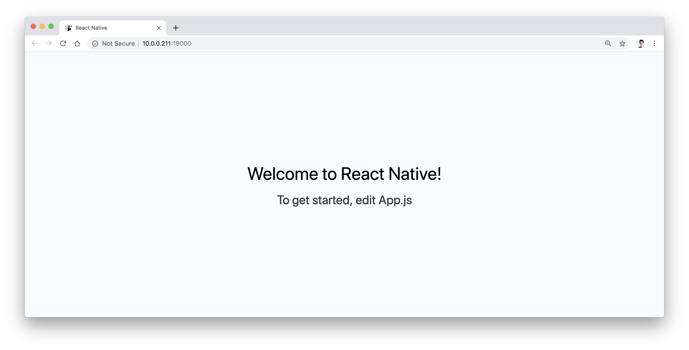
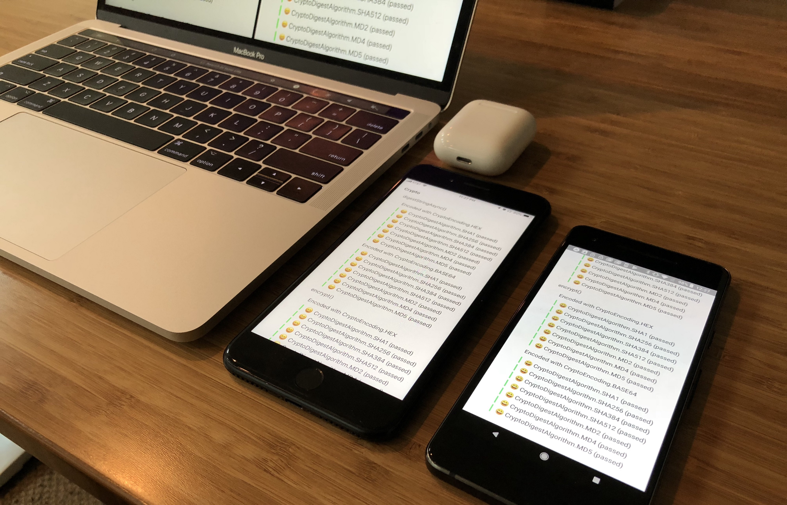

<Title date="2019-03-18T20:42:46.857Z">Expo CLI and SDK web support beta</Title>

Expo is on a mission to create the best possible end-to-end developer experiences for building and deploying apps on multiple platforms. Today we are very excited to announce experimental\* web support for the Expo CLI and SDK!

_Browser, Desktop PWA, Mobile PWA, Native Mobile Apps_

_It is stable enough for you to start playing with it, but not quite stable enough that you should use it to deploy an important app to production quite yet. Additionally, it will not be until the next SDK version that Expo Web projects are compatible with managed Android and iOS projects since this web beta is not part of an official Expo SDK version._

## React Native and the web platform

The two most notable projects that have brought React Native to the web are react-native-web (RNW) and react-native-dom (RND). RNW is the most pragmatic of the two — it provides implementations of React Native primitives like View, Text, and Image that render to the web equivalents like div, span, and img and otherwise is generally just like a normal webpage that uses the underlying platform. [The StyleSheet API is pretty great too](https://github.com/necolas/react-native-web/blob/master/docs/guides/style.md) — it's “one of the fastest, safest, and most efficient styles-in-JavaScript solutions”. RND does some awesome and experimental stuff like skipping the browser layout engine and running [Yoga](https://github.com/facebook/yoga), the same library that React Native uses on mobile. It's worth checking out but it's not meant for building production apps today.
[**necolas/react-native-web**
*React Native for Web. Contribute to necolas/react-native-web development by creating an account on GitHub.*github.com](https://github.com/necolas/react-native-web)

[**Nicolas Gallagher**](https://twitter.com/necolas) built RNW while also using it to create the [**Twitter Lite PWA**](https://developers.google.com/web/showcase/2017/twitter). [Major League Soccer](https://matchcenter.mlssoccer.com/), [Flipkart](https://twitter.com/naqvitalha/status/969577892991549440), [Uber](https://www.youtube.com/watch?v=RV9rxrNIxnY), [The Times](https://github.com/newsuk/times-components), and [DataCamp](https://www.datacamp.com/community/tech/porting-practice-to-web-part1) have all since built mobile web and desktop apps around RNW. We also consulted our friends at Facebook to get a second opinion on web support. When it came to building web support into Expo tools, we naturally gravitated towards RNW.

## Setting up react-native-web alongside react-native for iOS and Android

We've heard from users that want to share code between web, iOS, and Android that it is challenging to set up react-native-web in both new and existing projects; it requires familiarity with tools like Webpack, Metro, and Babel just to get started. We've tried to make this easy with expo-cli:

To add web support to** [an Expo project](https://github.com/expo/web-examples/tree/master/expo-managed-workflow), **or [a react-native init project](https://github.com/expo/web-examples/tree/master/react-native-init),

- Ensure you're using the latest version of babel-preset-expo
- Install react-native-web, and react-dom.
- Add the property “web” to the expo.platforms array in your app.json
- Then run expo start with the latest version of the expo-cli after the bundler has started, you can press the w key to open your app in the browser.

[**We've also assembled a guide for usage with `create-react-app`**](https://github.com/expo/web-examples/blob/master/create-react-app-example)!

Behind the scenes we handle the Webpack and Babel configuration for you. We've configured Webpack so that your new project will get a PWA score of 100 in Chrome's Lighthouse Audit right out of the box. [Workbox by Google](https://developers.google.com/web/tools/workbox/), for example, is installed by default. Your PWA manifest and other configuration is automatically generated from your app.json, so properties like icons, title, orientation, and theme color don't need to be maintained in a separate file if you don't want to.

## Expo SDK is now “tri-platform”

Once your project is set up, you will ask yourself “what's next?” Well, you probably want to write code. Actually, why write code when you can install some from npm, drop it in your app, and take the rest of the day off? Sadly you may find that this won't work quite as well as you would expect with RNW because most libraries in the React Native community do not support web.

_Gaming in the browser with Expo and Three.js_

What does it mean to support web? It means that either all of the code in the package depends only on the primitives that RNW makes available, or wherever that's not possible within the package it provides an alternative implementation with the `.web.js` extension. Over the past few months we have updated most of the Expo SDK to work the same on web where possible, and fall back to something reasonable where not. For example, expo-linear-gradient [uses the linear-gradient CSS function ](https://github.com/expo/expo/blob/master/packages/expo-linear-gradient/src/NativeLinearGradient.web.tsx)on web since it's available there, but expo-calendar doesn't do anything because there is no equivalent web API. This won't quite solve all your problems but we hope it helps. We also have started to work on [a document](https://github.com/expo/expo/blob/d64340f028d8d2a0ce69e85efa3c915bbadb7413/guides/Creating%20Web%20Platform%20Modules.md)that can help guide developers to build React Native libraries that work on iOS, Android, and web. See the list of [currently supported SDK modules here](https://github.com/expo/web-examples/blob/master/FEATURES.md), and head over to [native.directory](https://www.native.directory/) to filter by web to see what else is available.

It's also worth noting that now that you can use Expo APIs in any React Native app, you can also use them in any RNW app, so if you're using create-react-app or another tool with RNW rather than Expo CLI, you can still install expo-linear-gradient, for example, and use it in your project.**_ [Here is an example](https://github.com/expo/web-examples/tree/master/react-native-init)._**

## Deployment

We've put together comprehensive guides for uploading your project to a variety of services; **GitHub Pages, AWS, Netlify, Surge**, and **Now** have guides here: [Deploying Expo Web Apps](https://github.com/expo/web-examples/blob/master/DEPLOYMENT.md) (and feel free to add more!). The default Webpack config for managed Expo projects will produce gzipped and Brotli compressed artifacts, so feel free to just run that build command and get deploying.

## What's next

While in beta you can't use web and native at the same time since the preview version is slightly ahead of the natively deployed build, this is just due to the fact that we're between release cycles. We also want to make webpack very customizable without needing to “eject” or start from scratch. Finally the CLI also has lots of exciting potential that we want to explore!

In the next few months we'll also be talking more in-depth about features and plans at [**App.js Conf**](https://appjs.co/) and [**React Europe**](https://www.react-europe.org/).

Over the coming weeks we'll also be releasing best practices for creating modules that work on web and native.

## Try it out

Read over the [**example docs**](https://github.com/expo/web-examples) to give this all a try[.](https://github.com/expo/expo/blob/master/guides/Enabling%20the%20Expo%20Web%20Target.md) The main reason I'm announcing this is to summarize all of the web PRs we've been landing, keep you updated with the progress, and to get your feedback. I've found that just having the ability to run an Expo project on the web quickly reveals what needs to be done to make the tools better (usually via error messages 😅). Let us know what you think in the comments or [on Twitter](https://twitter.com/expo).

[https://github.com/expo/web-examples](https://github.com/expo/web-examples)
